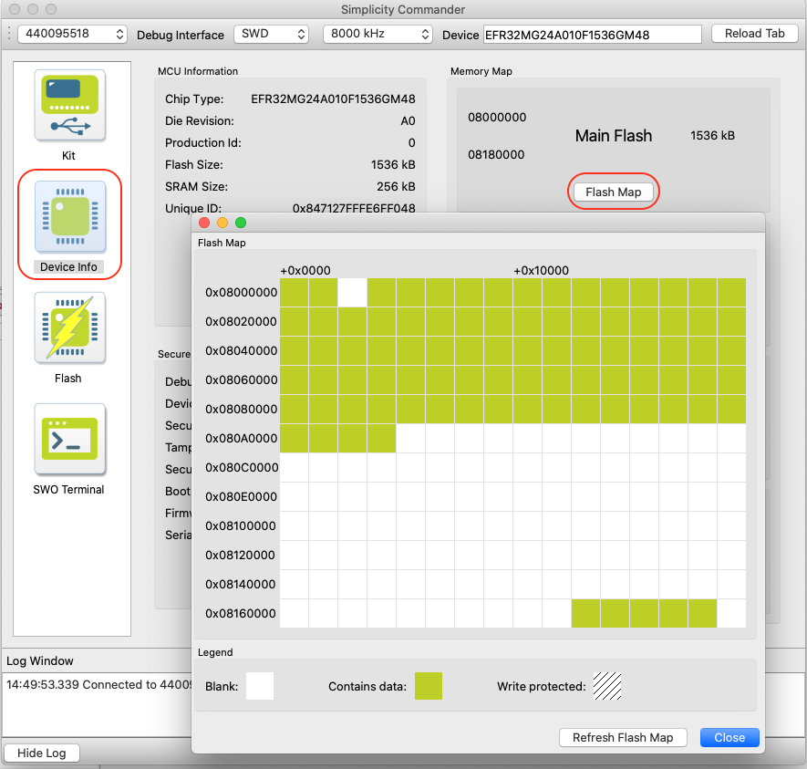
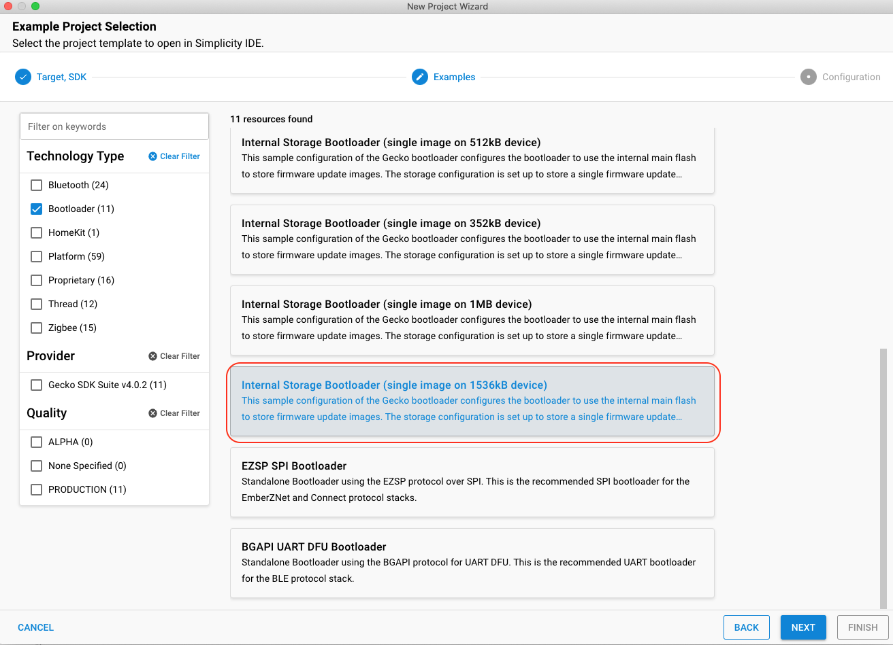
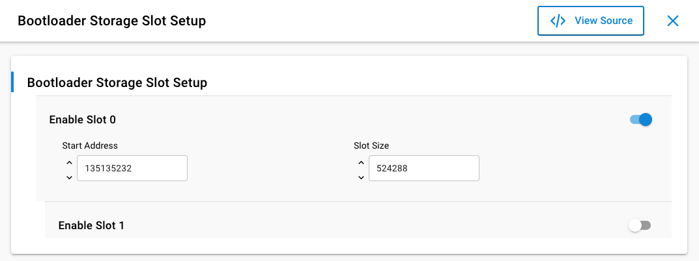
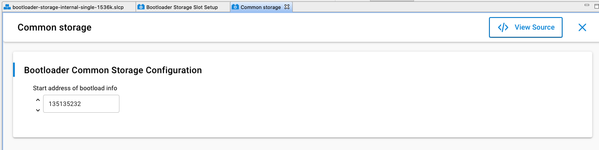
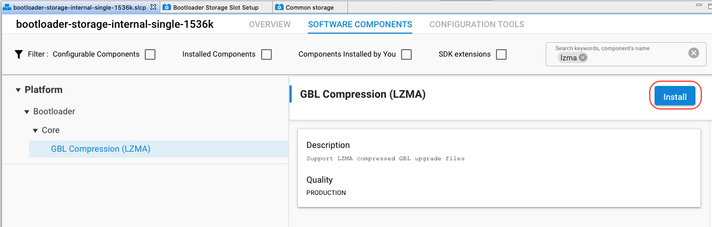

# 实验：OTA实验 - 内部Flash

本实验介绍如何通过OTA升级Matter Lighting设备，OTA固件存储在EFR32芯片的内部Flash中。


## 实验准备
- 搭建基于BRD4186A（MG24）开发版的Matter Lighting设备
 - 参考[编译Matter Lighting Example](编译MatterLightingExample.md)为BRD4186A编译Matter Lighting固件，EFR32 Matter Lighting Example默认支持OTA功能。由于芯片内部Flash有限，通过以下命令编译固件可以关闭一些debug功能和二维码，减小code size。 

	```bash
	./scripts/examples/gn_efr32_example.sh ./examples/lighting-app/efr32 ./out/lighting-app BRD4186A "chip_detail_logging=false \
	chip_automation_logging=false \
	chip_progress_logging=true \
	is_debug=false \
	show_qr_code=false \
	chip_build_libshell=false \
	chip_openthread_ftd=true \
	enable_openthread_cli=false"	
	```
	 
  - 将编译产生的固件和任意bootloader烧录到开发版中，并通过[Commander工具](https://www.silabs.com/developers/simplicity-studio#commander)读出芯片的Flash Map。这一步的目的是读出Flash Map，后面根据Flash Map配置Internal Storage Bootloader。白色区域为没有被使用的Flash区域，可以用来存储OTA文件。
  
    
  
 -  使用Simplicity Studio产生bootloader-storage-internal-single-1536k工程
 
    
  
 - 进入Bootloader Storage Slot Setup组件，配置Slot的起始地址和大小，Slot用来存放OTA文件。根据Flash Map，我们可以将使用LZMA算法压缩后的OTA文件存储在0x080E0000到0x0815ffff。
 
     
    
  - 进入Common storage组件，配置Start address of bootload info。改参数与Slot的起始地址一致。

     

  - 安装lzma组建，支持OTA固件压缩
  
       
   
 - 编译bootloader-storage-internal-single-1536k工程
 
 - 将编译产生的Matter Lighting固件和Bootloader固件烧录到开发板
 
   

- 搭建树莓派环境
 - 参考[搭建Open Thread Board Router](搭建OpenThreadBoardRouter.md)在树莓派上搭建OTBR
 - 参考[编译Matter Controller](编译MatterController.md)在OTBR编译Matter Controller
 - 在OTBR上编译OTA Provider
 
    ```bash
     cd connectedhomeip
     scripts/examples/gn_build_example.sh examples/ota-provider-app/linux out/debug chip_config_network_layer_ble=false
    ```
    
    
- 准备OTA固件
 - 修改软件版本号。在connectedhomeip/examples/lighting-app/efr32/include/CHIPProjectConfig.h中修改Matter Lighting工程的软件版本号，OTA固件的软   件版本号需大于当前设备的软件版本号。

    ```bash
     #define CHIP_DEVICE_CONFIG_DEVICE_SOFTWARE_VERSION 9
    ```
  
 - 重新编译Matter Lighting Example。这里使能二维码显示功能，方便实验对照。

    ```bash
	./scripts/examples/gn_efr32_example.sh ./examples/lighting-app/efr32 ./out/lighting-app BRD4186A "chip_detail_logging=false \
	chip_automation_logging=false \
	chip_progress_logging=true \
	is_debug=false \
	show_qr_code=true \
	chip_build_libshell=false \
	chip_openthread_ftd=true \
	enable_openthread_cli=false"	
	```

 - 使用[Commander命令行](https://www.silabs.com/documents/public/user-guides/ug162-simplicity-commander-reference-guide.pdf)生成lzma压缩的GBL文件
 
    ```bash
    commander gbl create out/lighting-app/BRD4186A/chip-efr32-lighting-example-lzma.gbl --app out/lighting-app/BRD4186A/chip-efr32-lighting-example.s37 --compress lzma
   ```

  
 - 生成OTA固件，-vn  -vs 参数要与.Matter Lighting Example的软件版本号一致
 
    ```bash
    ./src/app/ota_image_tool.py create -v 0xFFF1 -p 0x8005 -vn 9 -vs "9.0" -da sha256 out/lighting-app/BRD4186A/chip-efr32-lighting-example-lzma.gbl out/lighting-app/BRD4186A/chip-efr32-lighting-example-lzma-v9.ota
    ```
 
 - 将chip-efr32-lighting-example-v9.ota文件拷贝到OTBR的/connectedhomeip文件夹下
    
## 实验步骤

- 在树莓派上启动OTA Provider

    ```bash
    cd connectedhomeip
    rm -r /tmp/chip_*
    ./out/debug/chip-ota-provider-app -f chip-efr32-lighting-example-lzma-v9.ota
    ```
    
- 打开另一个终端，用chip tool将OTA Provider加入到网络中. 5678为OTA Provider的node id，pin code为默认值20202021。

    ```bash
    cd connectedhomeip/out/standalone/
    ./chip-tool pairing onnetwork 5678 20202021
    ```

- 授予网络中所有设备操作OTA Provider cluster (0x0029) 的权限。5678为OTA Provider的node id，后面的0为endpoint。

    
    ```bash
    ./chip-tool accesscontrol write acl '[{"fabricIndex": 1, "privilege": 5, "authMode": 2, "subjects": [112233], "targets": null}, {"fabricIndex": 1, "privilege": 3, "authMode": 2, "subjects": null, "targets": null}]' 5678 0
    ```
    

- 参考[通过安装在OTBR上的Matter Controller控制Matter Lighting设备](通过安装在OTBR上的MatterController控制MatterLighting设备.md)将Matter Lighting设备加入到网络中。

- 通知Matter设备升级。5678为OTA Provider的node id，1234为Matter Lighting的node id。

    ```bash
    ./chip-tool otasoftwareupdaterequestor announce-ota-provider 5678 0 0 0 1234 0
    ```
    
- Matter设备收到announce-ota-provider命令后向OTA Provider请求固件。
     
## 注意事项
OTA Provider和Matter设备多次入网时，需要分配不同的node id， 否则会出现入网失败的问题。
也可以通过以下命令清除chip tool的缓存。清除缓存后，OTA Provider和Matter设备需要重新入网。

  ```bash
  cd connectedhomeip
  rm -r /tmp/chip_*
  ```  
  
   


