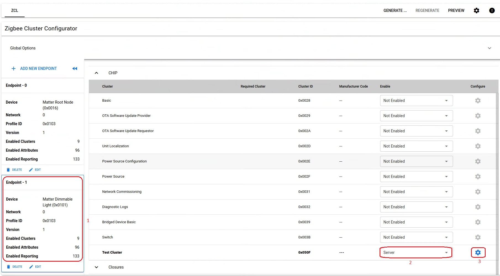

# 在Matter中添加Cluster

本文将介绍如何在Matter的现有example中添加Cluster。Matter的数据模型是由Endpoint以及Endpoint中使能的Cluster来实现的。Matter的Endpoint和Cluster是用[芯科科技](https://www.silabs.com)贡献的[ZAP](https://github.com/project-chip/zap)工具来配置的。用户只需要在zap的可视化界面上配置Endpoint和Cluster，然后即可通过工具生成相关的代码框架。  

## 配置ZAP运行环境

ZAP是基于Node.js开发的，所以运行ZAP需要首先安装[Node.js](https://nodejs.org/en/).

- 下载并安装Node.js的最新版本16.15.0 LTS。

  ```bash
  curl -fsSL https://deb.nodesource.com/setup_lts.x | sudo -E bash -
  sudo apt-get install -y nodejs
  ```

- 切换到Matter的源码根目录，通过运行如下命令来启动ZAP。由于ZAP是一个GUI工具，所以请在图形界面的环境中开启终端，然后执行如下命令。

  ```bash
  cd scripts/tools/zap
  ./run_zaptool.sh
  ```

- 在更新Node.js版本，或者之前曾经尝试过启动ZAP的情况下，在用户根目录下会生成`.zap`和`.npm`两个临时文件夹。在ZAP工具启动不成功的情况下，可以尝试删除这两个临时文件夹再重试。

  ```bash
  rm -rf ~/.zap
  rm -rf ~/.npm
  ```

- 启动成功后，可以看到ZAP的界面，如下：
  
  

## 配置Endpoint和Cluster

- 用鼠标点击菜单`File` -> `Open File`，打开Matter example对应的`.zap`文件。例如`examples/lighting-app/lighting-common/lighting-app.zap`。打开后，在界面左侧可以看到Endpoint列表。右侧是当前选中的Endpoint里面的Cluster配置。

  

- 这里，Endpoint 0是Matter的`root endpoint`，用于描述整个设备。其它的Endpoint则是用户根据具体应用需求来配置的。这里以添加`test cluster`为例，来描述如何添加Cluster，以及配置相关的属性和命令。选中左边的Endpoint 1，然后在右边的界面，找到`CHIP`这一栏下面的`Test Cluster`，使能其`server`端。

  

- 接着点击`Test Cluster`这一行最右侧的小齿轮图标，进入Cluster的设置界面。默认的界面是属性设置的界面。这里使能ID为`0x0000`的这个属性，并且将默认值设置为0。

  

- 点击上方的`COMMANDS`这个标签，进入Command的设置。这里使能Client发给Server的ID为0x00的这个命令。

  

- 配置完成后，无比点击菜单`File` -> `Save`来保存。

- 点击左上方的`Back`返回到主页面，然后点击右上方的`GENERATE`按钮来生成代码，然后在弹出的对话框中选择输出代码的路径，选择`OK`来确认。对于`lighting-app`这个例程，输出的路径是`zzz_generated/lighting-app/zap-generated`。
  
  

- 将生成的文件`zzz_generated/lighting-app/zap-generated/Clusters.matter`复制到`examples/lighting-app/lighting-common/`文件夹下，替换`lighting-app.matter`。

## 添加代码

- 对于Test Cluster的初始化，可以在文件`examples/lighting-app/efr32/src/ZclCallbacks.cpp`中新增回调函数`emberAfTestClusterClusterInitCallback`，并添加相应代码来实现需要的功能。
  
  ```c
  void emberAfTestClusterClusterInitCallback(EndpointId endpoint)
  {
    ChipLogProgress(Zcl, "**** Init for Test Cluster in Endpoint %d ****", endpoint);
  }
  ```

- 如果要订阅Test Cluster中的属性变化事件，可以修改文件`examples/lighting-app/efr32/src/ZclCallbacks.cpp`中的`MatterPostAttributeChangeCallback`这个回调函数。

  ```c
  void MatterPostAttributeChangeCallback(const chip::app::ConcreteAttributePath & attributePath, uint8_t mask, uint8_t type, uint16_t size, uint8_t * value)
  {
    ...

    // add a branch to handle attribtue change for Test Cluster
    else if (clusterId == TestCluster::Id)
    {
      ChipLogProgress(Zcl, "Test Cluster attribute ID: " ChipLogFormatMEI " Type: %u Value: %u, length %u", ChipLogValueMEI(attributeId), type, *value, size);      
    }
  }
  ```

- Test Cluster中的test命令的处理是在`src/app/clusters/test-cluster-server/test-cluster-server.cpp`文件中的`emberAfTestClusterClusterTestCallback`函数里面实现的。如果要添加额外的代码，可以修改这个函数。例如，下面代码在函数入口处添加了一条调试打印。

  ```c
  bool emberAfTestClusterClusterTestCallback(app::CommandHandler *, const app::ConcreteCommandPath & commandPath, const Test::DecodableType & commandData)
  {
    // add this debug log
    ChipLogProgress(Zcl, "**** Handle test CMD in Endpoint %d ****", commandPath.mEndpointId);

    // Setup the test variables
    emAfLoadAttributeDefaults(commandPath.mEndpointId, true, MakeOptional(commandPath.mClusterId));
    for (int i = 0; i < kAttributeListLength; ++i)
    {
        gListUint8Data[i] = 0;
        gListOctetStringData[i].SetLength(0);
        gListOperationalCert[i].SetLength(0);
        listStructOctetStringData[i].fabricIndex     = 0;
        listStructOctetStringData[i].operationalCert = ByteSpan();
        gSimpleEnums[i]                              = SimpleEnum::kUnspecified;
    }
    gSimpleEnumCount = 0;

    gStructAttributeValue = Structs::SimpleStruct::Type();

    gNullableStructAttributeValue.SetNull();

    gNullablesAndOptionalsStruct = Structs::NullablesAndOptionalsStruct::Type();

    emberAfSendImmediateDefaultResponse(EMBER_ZCL_STATUS_SUCCESS);
    return true;
  }
  ```

## 测试验证

- 编译，并烧录程序到目标板。用JLinkRTTViewer查看启动时的打印。
  
  

- Commission目标板到Matter网络中，用chip-tool执行命令，发送Test Cluster的test命令到目标板的Endpoint 1.
  
  ```bash
  ./chip-tool testcluster test 1 1
  ```

- 在JLinkRTTViewer上，可以观察到之前添加的调试打印。
  
  

- 用chip-tool发送命令来修改ID为0x0000的属性
  
  ```bash
  ./chip-tool testcluster write-by-id 0x0000 true 1 1
  ```

- 在JLinkRTTViewer上，可以观察到之前添加的调试打印。

  