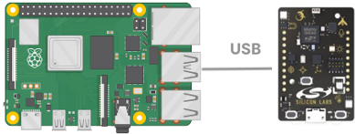
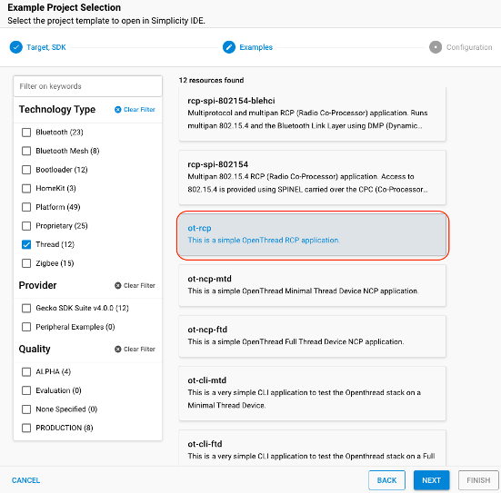
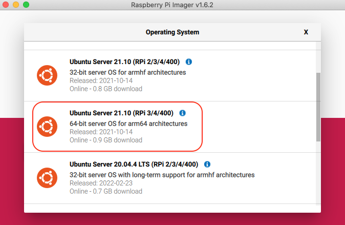
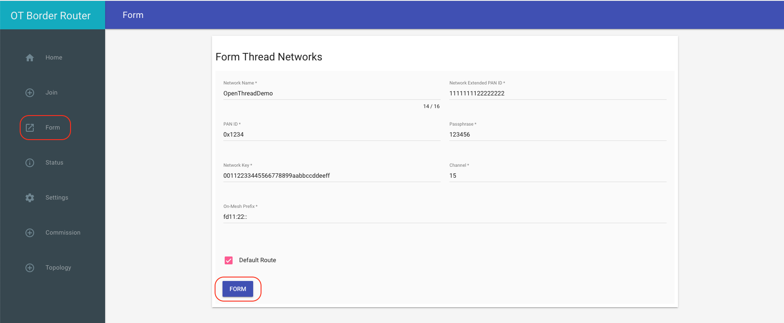
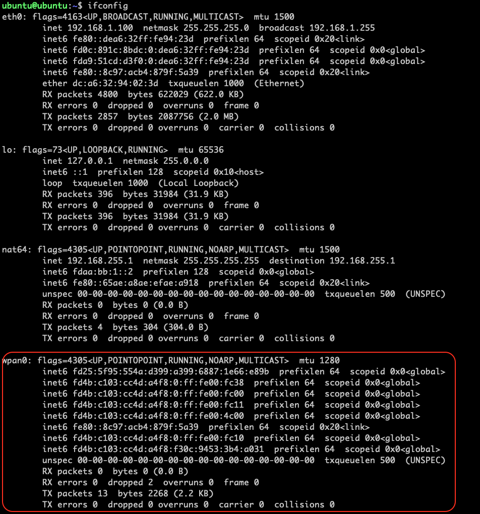

# 搭建Open Thread Board Router 

本文将介绍如何从零开始搭建open thread board router。OTBR的硬件是由一个树莓派4和一个[Thunderboard Sense 2](https://www.silabs.com/development-tools/thunderboard/thunderboard-sense-two-kit)组成，Thunderboard Sense 2作为RCP。

   
## 硬件需求
1个树莓派4

1个64GB SD卡

1个Thunderboard Sense 2

1台电脑(只用于SSH远程登录到树莓派)


## 编译RCP固件
 - 在电脑上下载并安装最新版本的[Simplicity Studio V5](https://www.silabs.com/developers/simplicity-studio)和openthread协议栈。
 - 在Simplicity Studio V5中新建ot-rcp工程

    
 - 编译ot-rcp工程，并使用[Simplicity Studio V5](https://docs.silabs.com/simplicity-studio-5-users-guide/5.3.0/ss-5-users-guide-building-and-flashing/flashing)将生成的固件烧录到Thunderboard Sense 2中。
 - 通过USB线将Thunderboard Sense 2链接到树莓派上。

## 搭建树莓派编译环境

 - 电脑上使用[Raspberry Pi Imager工具](https://www.raspberrypi.com/software/)将Ubuntu Server 21.10  64 bits系统安装到SD卡上。该image可以按照如下步骤找到：CHOOSE OS -	> Other general-purpose OS -> Ubuntu 
 
   

- 系统安装完毕后将SD卡插回树莓派中，并通过网线将树莓派连接到与电脑同一个局域网中。
-  通过SSH远程登录到树莓派上。
	-  windows用户可以使用[putty](https://www.ssh.com/academy/ssh/putty)或其他工具登陆到树莓派。
	-  Linux,Mac用户可以通过如下命令登陆到树莓派。192.168.1.18 为树莓派的ip地址。ubuntu为用户名，默认密码也是ubuntu。
	
   ```bash
	ssh ubuntu@192.168.1.18 
   ```

  
- 远程登录后，在树莓派上更新和安装依赖软件包

  ```bash
	sudo apt update
	sudo apt upgrade -y
	sudo apt install -y git vim gcc g++ python-is-python3 python3 python3-venv python3-pip \
	unzip pi-bluetooth avahi-daemon libavahi-client-dev libssl-dev libglib2.0-dev \
	ninja-build git build-essential protobuf-compiler wpasupplicant wireless-tools rfkill \
	libgirepository1.0-dev libcairo2-dev pkg-config python3-dev net-tools \
	python3-widgetsnbextension python3-testresources linux-modules-extra-raspi
	pip3 install pycairo
  ```
  
- 重启树莓派
 
  ```bash
  sudo reboot
  ```


## 编译安装OTBR
- 克隆OTBR SDK

  ```bash
   git clone https://github.com/openthread/ot-br-posix
  ```
  
- 进入ot-br-posix目录

  ```bash
	cd ot-br-posix
  ```
  
- Checkout一个稳定的版本，例如：f0bd216

  ```bash
	git checkout f0bd216
  ```
- 更新submodule

  ```bash
	git submodule update --init
  ```
  
- 安装OTBR依赖的软件包

  ```bash
	sudo ./script/bootstrap
  ```
  
- 编译安装OTBR

  ```bash
   sudo BACKBONE_ROUTER=1 INFRA_IF_NAME=eth0 ./script/setup
  ```
  
  eth0为树莓派网络接口的名称，如果树莓派是通过wifi连接到局域网，则需要将eth0改为wlan0.
 
 
- 修改OTBR\_AGENT\_OPTS

  ```bash
   sudo nano /etc/default/otbr-agent
  ``` 
  
  将/etc/default/otbr-agent文件中的OTBR\_AGENT\_OPTS替换为
  
   ```bash
    OTBR_AGENT_OPTS="-I wpan0 -B eth0 spinel+hdlc+uart:///dev/ttyACM0?uart-baudrate=460800 trel://eth0"
  ``` 
  
   eth0为树莓派网络接口的名称，如果树莓派是通过wifi连接到局域网，则需要将eth0改为wlan0.

 
- 重启树莓派后，OTBR就能正常工作了

  ```bash
	sudo reboot
  ```
   
## 建立Thread网络
 
   - 通过网页建立Thread网络
 
 在浏览器上输入树莓派的IP地址回登陆到Thread网络管理界面，点击Form按钮建立Thread网络。
    

 - 或者通过命令行建立Thread网络
    - SSH远程登录到树莓片
    - 输入以下命令建立Thread网络

	```bash
	sudo ot-ctl factoryreset 
	sudo ot-ctl dataset init new
	sudo ot-ctl dataset networkkey 00112233445566778899aabbccddeeff
	sudo ot-ctl dataset extpanid 1111111122222222
	sudo ot-ctl dataset panid 0x1234
	sudo ot-ctl dataset channel 15
	sudo ot-ctl dataset commit active
	sudo ot-ctl prefix add fd11:22::/64 pasor
	sudo ot-ctl ifconfig up
	sudo ot-ctl thread start
	```
  
 - Thread网络建立成功后，树莓派会自动创建Thread网络接口wpan0。 Open Thread Board Router搭建完毕。
 
    	
 	
 	
