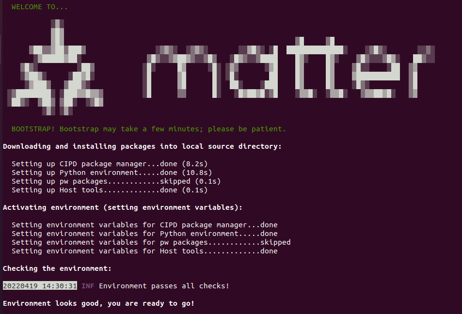

# 编译Matter Controller

目前Matter SDK实现了4种Matter Controller或者叫做chip-tool。
[Android chip-tool](https://github.com/project-chip/connectedhomeip/tree/master/src/android/CHIPTool)和[iOS chip-tool](https://github.com/project-chip/connectedhomeip/tree/master/src/darwin/CHIPTool
)是可以运行在手机上app，可以通过扫描matter设备上的二维码将设备加入到网络中, 并通过用户界面控制Matter设备。
[POSIX CLI chip-tool](https://github.com/project-chip/connectedhomeip/tree/master/examples/chip-tool
)是一个可以运行在linux系统上的命令行工具，通过执行命令行来实现入网，控制等功能。
[Python chip-device-ctrll](https://github.com/project-chip/connectedhomeip/tree/master/src/controller/python)是基于python实现的命令行工具，功能与POSIX CLI chip-tool类似。用户可以根据项目需要，选择任意一种Matter Controller。本文将介绍如何在电脑和树莓派(OTBR)上编译POSIX CLI chip-tool。


## 硬件需求
1台树莓派或者1台电脑


## 搭建端编译环境
参考[编译Matter Thread Lighting Example](编译MatterThreadLightingExample.md#搭建电脑端编译环境)搭建电脑端编译环境，或者参考[搭建Open Thread Board Router](搭建OpenThreadBoardRouter.md#搭建树莓派编译环境)搭建树莓派编译环境。

  
## 编译POSIX CLI chip-tool
  
- 克隆Matter SDK


  ```bash
	git clone https://github.com/project-chip/connectedhomeip
  ```
- 进入Matter SDK目录

  ```bash
	cd connectedhomeip
  ```
- Checkout一个稳定的版本，例如sve branch：333fa10187d34ed1209cddd6c1fe40d55968a93a

  ```bash
	git checkout 333fa10187d34ed1209cddd6c1fe40d55968a93a
  ```
- 更新submodule

  ```bash
	git submodule update --init
  ```
- 构建编译环境。此过程需要时间较长，且有些依赖包需要VPN才能下载。

  ```bash
	source scripts/bootstrap.sh
  ```
  
- 编译环境搭建成功后会有如下提示

  
  
  如果遇到错误，一般是由于网络不稳定，一些依赖软件包下载不完全导致。可尝试删除connectedhomeip目录重新下载。

  
- 编译chip-tool

  ```bash
   ./scripts/examples/gn_build_example.sh examples/chip-tool out/standalone 
  ```
  
  编译完成后，可执行文件将会在生成在out/standalone文件夹下。

	  
  


