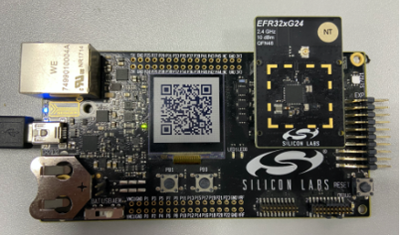

# 编译Matter Lighting Example 

本文将介绍如何从零开始编译基于Silicon Labs EFR32 平台的Matter Lighting Example。


## 硬件需求
1个	[wstk main board](https://www.silabs.com/wireless/zigbee/efr32mg24-series-2-socs)

1个BRD4186A Radio Board(或者其他支持Matter的radio board)

1台安装了的VirtualBox虚拟和Ubuntu 20.04 LTS的电脑


## 搭建电脑端编译环境
本文采用安装了Ubuntu 20.04 LTS的VirtualBox虚拟机编译Matter Lighting Example。

- 安装VirtualBox和Ubuntu 20.04 LTS
  - [VirtualBox](https://www.virtualbox.org/)
  - [Ubuntu 20.04.x LTS](https://ubuntu.com/download/desktop)
   
- 在Ubuntu上更新和安装依赖软件包

  ```bash
	sudo apt update
	sudo apt upgrade -y
	sudo apt-get install git gcc g++ python pkg-config libssl-dev libdbus-1-dev \
	libglib2.0-dev libavahi-client-dev ninja-build python3-venv python3-dev \
	python3-pip unzip libgirepository1.0-dev libcairo2-dev libreadline-dev
    sudo reboot
  ```
  
## 编译Lighting固件
  
- 克隆Matter SDK


  ```bash
	git clone https://github.com/project-chip/connectedhomeip
  ```
- 进入Matter SDK目录

  ```bash
	cd connectedhomeip
  ```
- Checkout一个稳定的版本，例如：cfc35951be66a664a6efdadea56d1b8ea6e63e96

  ```bash
	git checkout cfc35951be66a664a6efdadea56d1b8ea6e63e96
  ```
- 更新submodule

  ```bash
	git submodule update --init
  ```
- 构建编译环境。此过程需要时间较长，且有些依赖包需要VPN才能下载。

  ```bash
	source scripts/bootstrap.sh
  ```
  
- 编译环境搭建成功后会有如下提示

  
  
  
- 编译固件

	输入如下命令编译固件。BRD4186A为radio板的型号，更多支持的型号请参考：[https://github.com/project-chip/connectedhomeip/tree/master/examples/lighting-app/efr32](https://github.com/project-chip/connectedhomeip/tree/master/examples/lighting-app/efr32)
	
	```bash
	./scripts/examples/gn_efr32_example.sh ./examples/lighting-app/efr32/ ./out/lighting-app BRD4186A
	```
	  
	  
	 开发者还可以通过一些编译选项打开或关闭相应的功能模块。例如，用以下命令编译出的固件关闭了debug log和二维码等功能,减小了code size。
	 

	```bash
	./scripts/examples/gn_efr32_example.sh ./examples/lighting-app/efr32 ./out/lighting-app BRD4186A "chip_detail_logging=false \
	chip_automation_logging=false \
	chip_progress_logging=false \
	is_debug=false \
	show_qr_code=false \
	chip_build_libshell=false \
	chip_openthread_ftd=false \
	enable_openthread_cli=false"	
	``` 
  


## 烧录固件

 编译完成后，固件会生成在connectedhomeip/out/lighting-app/BRD4186A文件夹下。使用[Simplicity Studio](https://docs.silabs.com/simplicity-studio-5-users-guide/5.3.0/ss-5-users-guide-building-and-flashing/flashing)将chip-efr32-lighting-example.s37文件和bootloader文件烧录到wstk板上，开发者可以通过Simplicity Studio编译bootloader固件，也可以直接使用pre-build bootloader固件。pre-build bootloader固件可以在connectedhomeip/third_party/efr32_sdk/repo/platform/bootloader/sample-apps/bootloader-storage-spiflash-single文件夹下找到。
 
烧录成功后LCD会显示Matter设备的二维码。
 
  

## 修改按键和led灯的GPIO

可以通过修改connectedhomeip/third_party/efr32_sdk/repo/matter/efr32/efr32mg24/BRD4186A文件夹下相应的的配置文件来修改按键或led灯的gpio，例如sl_simple_led_led1_config.h为led1的配置文件。

