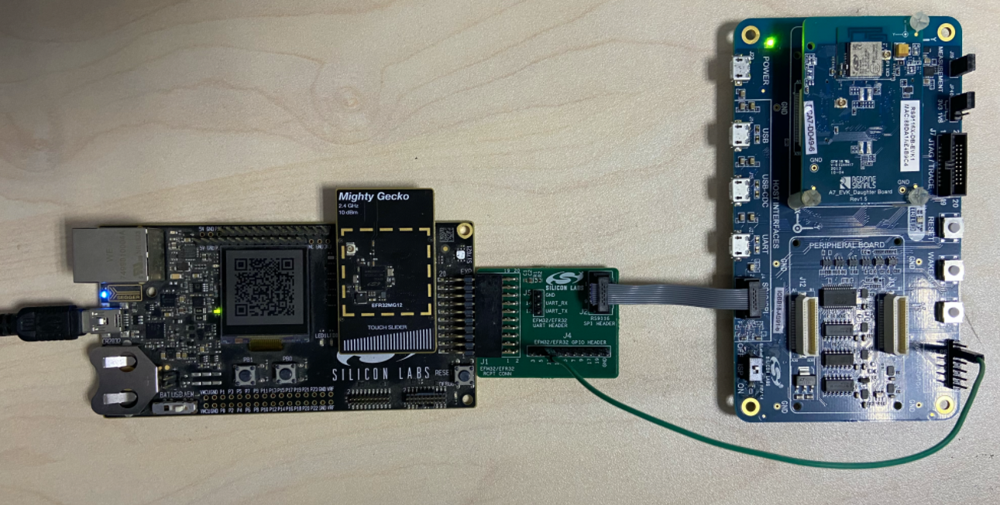
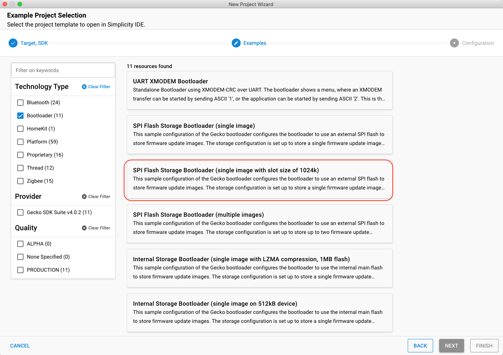
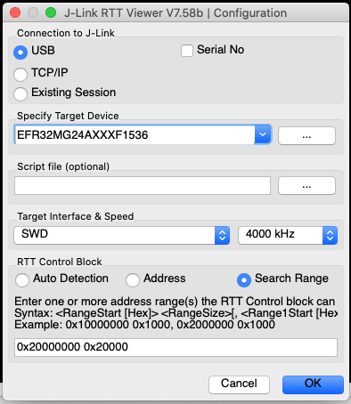
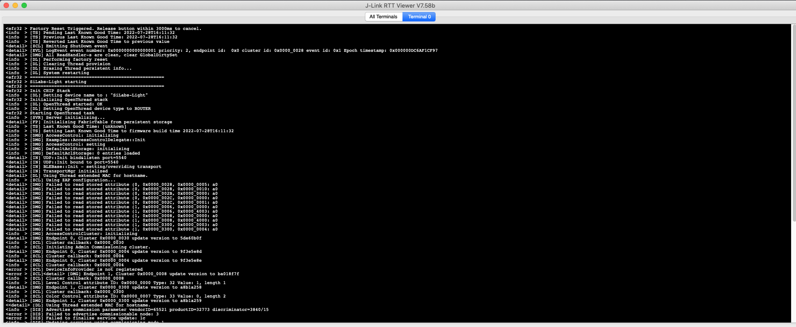

# 编译Matter Wifi Lighting Example

本文将介绍如何从零开始编译基于Silicon Labs EFR32和RS9116平台的Matter Wifi Lighting Example。


## 硬件需求
1个	[wstk main board](https://www.silabs.com/wireless/zigbee/efr32mg24-series-2-socs)

1个BRD4161A Radio Board（跑Matter程序）

1个RS9116 EVK （Wifi射频模块）

1个连接板，用于连接WSTK和RS9116 EVK

1条杜邦线，用于连接WSTK（Pin11）和RS9116 EVK（RTS_PS）板上的复位脚

硬件连接如下图所示：



  
## 编译固件
  
- RS9116固件（RS9116W.2.6.0.0.34.rps）可在此[链接](  https://github.com/SiliconLabs/wiseconnect-wifi-bt-sdk/tree/master/firmware
)中找到。

- 编译BRD4161A Matter Lighting固件
	
	- 参考[编译Matter Thread Lighting Example](编译MatterThreadLightingExample.md)搭建编译环境。
	- 输入如下命令编译固件

  ```bash
	cd connectedhomeip
  ```
  
  ```bash
	./scripts/examples/gn_efr32_example.sh examples/lighting-app/efr32/ out/rs911x_lighting BRD4161A --wifi rs911x
  ```
   - 编译完成后，固件chip-efr32-lighting-example.s37会生成在connectedhomeip/out/rs911x_lighting/BRD4161A文件夹下。  

- 编译BRD4161A Bootloader固件

 -  使用Simplicity Studio产生bootloader-storage-spiflash-single-1024k工程
 
  
  
 - 采用默认配置编译bootloader-storage-spiflash-single-1024k工程 
 - 编译完成后，bootloader固件bootloader-storage-spiflash-single-1024k.s37将会生成在SimplicityStudio/v5_workspace/bootloader-storage-spiflash-single-1024k/GNU ARM v10.2.1 - Default文件夹下。


## 烧录固件

 - RS9116固件烧录

  参考[rs9116w-firmware-update-application-note](https://www.silabs.com/documents/login/application-notes/an1290-rs9116w-firmware-update-application-note.pdf)6.2章节烧录RS9116固件。

 - EFR32固件烧录

 使用[Simplicity Studio](https://docs.silabs.com/simplicity-studio-5-users-guide/5.3.0/ss-5-users-guide-building-and-flashing/flashing)将chip-efr32-lighting-example.s37文件和bootloader文件烧录到wstk板上。烧录成功后LCD会显示Matter设备的二维码。
 

## 功能介绍

**LCD**: 显示设备二维码，手机App可通过扫描二维码将设备加入Matter网络。

**LED0**: 指示设备的连接状态。

- 50ms开950ms关：设备处于未入网状态
- 100ms开100ms关：设备正在做commissioning
- 50ms开950ms关：commissioning成功

**LED1**: 指示灯的状态。

- 关：灯处于关闭状况
- 开：灯处于打开状态

**Button0**: 

- 短按：使BLE advertisement 处于 fast mode，30秒后退出fast mode。
- 长按：使设备恢复出厂设置。注意：长按Button0后LED0和LED1会同时闪烁，闪烁结束后松开Button0才能将设备成功恢复出厂设置。

**Button1**: 

- 短按：切换灯的开关状态。

**使用Chip Tool配网**: 

Chip Tool和Matter Wifi Lighting设备需要加入同一个无线路由器，Chip Tool上输入以下命令进行配网，1133为Matter Wifi Lighting设备的NodeID，同时还要输入无线路由器的ssid和passward。

  ```bash
./chip-tool pairing ble-wifi 1133 ssid passward 20202021 3840
  ```

**使用Chip Tool控制设备**: 

通过Chip Tool发送如下命令切换灯的开关状态。1为灯设备的Endpoint。

  ```bash
	chip-tool onoff on NodeID 1
	chip-tool onoff off NodeID 1
	chip-tool onoff toggle NodeID 1
  ```
  
## 通过RTT Viewer查看Matter设备的log

- 下载并安装[RTT Viewer](https://www.segger.com/products/debug-probes/j-link/tools/rtt-viewer/)  

- 按照下图配置RTT Viewer
  
   
   
- 点击“OK”后，显示如下log

	
 

