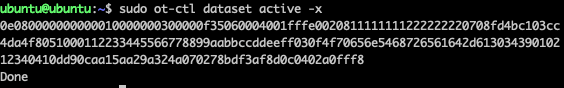

# 实验：通过安装在OTBR上的Matter Controller控制Matter Lighting设备

本实验介绍如何通过树莓派(OTBR)上的Matter Controller控制Matter Lighting设备。


## 实验准备
- 参考[编译Matter Lighting Example](编译MatterLightingExample.md)准备Matter Light设备
- 参考[搭建Open Thread Board Router](搭建OpenThreadBoardRouter.md)在树莓派上搭建OTBR
- 参考[编译Matter Controller](编译MatterController.md)在树莓派(OTBR)上编译Matter Controller

## 通过树莓派(OTBR)上的Matter Controller控制Matter Lighting设备
- SSH远程登录到OTBR
- 并输入以下命令获取Thread网络信息(operational dataset)

  ```bash
  sudo ot-ctl dataset active -x
  ```
  
- 进入Matter Controller文件夹，输入pairing命令“chip-tool pairing ble-thread (node id) hex:(operational dataset) (pin code) (discriminator)”将Matter Lighting设备加入到网络中。其中node id为Matter设备的节点ID，这里可以分配任意ID给Matter设备。operational dataset可以从上一步获取。pin code为默认值20202021，discriminator为默认值3840。

  ```bash
  cd /connectedhomeip/out/standalone
  ./chip-tool pairing ble-thread 1234 hex:0e080000000000010000000300000f35060004001fffe0020811111111222222220708fd4bc103cc4da4f8051000112233445566778899aabbccddeeff030f4f70656e5468726561642d61303439010212340410dd90caa15aa29a324a070278bdf3af8d0c0402a0fff8 20202021 3840
  ```
  
- Commissioning成功后，发送toggle命令控制Matter Lighting设备。1214为入网时分配的node id，1为endpoint id。

  ```bash
  ./chip-tool onoff toggle 1234 1
  ```  
 
- Matter Lighting设备收到toggle命令后，WSTK板上的LED1的状态会翻转。
 
## 注意事项
设备多次入网时，需要分配不同的node id， 否则会出现入网失败的问题。也可以通过以下命令清除chip tool的缓存。

  ```bash
  cd connectedhomeip
  rm -r /tmp/chip_*
  ```  
  
  
