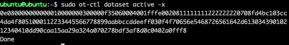

# 实验：通过安装在电脑上的Matter Controller控制Matter Lighting设备

本实验介绍如何通过电脑上的Matter Controller控制Matter Lighting设备。


## 实验准备
- 参考[编译Matter Lighting Example](编译MatterLightingExample.md)准备Matter Light设备
- 参考[搭建Open Thread Board Router](搭建OpenThreadBoardRouter.md)在树莓派上搭建OTBR
- 参考[编译Matter Controller](编译MatterController.md)在电脑上编译Matter Controller
- 在OTBR上安装配置RADVD服务，解决电脑到Matter Device的ipv6路由问题。
	- 安装RADVD
	
    ```bash
    sudo apt update
    sudo apt install radvd
    ```
 - 创建  /etc/radvd.conf 配置文件

  ```bash
  sudo nano /etc/radvd.conf
  ```

  - 将以下内容保存在/etc/radvd.conf文件

  ```
  interface eth0 {
  AdvManagedFlag on;
  AdvSendAdvert on;
  MinRtrAdvInterval 30;
  MaxRtrAdvInterval 60;
  prefix fd11:33::1/64 {
      AdvOnLink on;
      AdvAutonomous on;
      AdvRouterAddr on;
      };
  };
  ```
 - 运行 radvd service

  ```bash
  sudo systemctl restart radvd
  ```
 - 重启树莓派

  ```bash
	sudo reboot
  ```

## 通过电脑上的Matter Controller控制Matter Lighting设备
- SSH远程登录到OTBR
- 并输入以下命令获取Thread网络信息(operational dataset)

  ```bash
  git clone https://github.com/project-chip/connectedhomeip
  ```
  
- 进入Matter Controller文件夹，输入pairing命令“chip-tool pairing ble-thread (node id) hex:(operational dataset) (pin code) (discriminator)”将Matter Lighting设备加入到网络中。其中node id为Matter设备的节点ID，这里可以分配任意ID给Matter设备。operational dataset可以从上一步获取。pin code为默认值20202021，discriminator为默认值3840。

  ```bash
  cd /connectedhomeip/out/standalone
  ./chip-tool pairing ble-thread 1234 hex:0e080000000000010000000300000f35060004001fffe0020811111111222222220708fd4bc103cc4da4f8051000112233445566778899aabbccddeeff030f4f70656e5468726561642d61303439010212340410dd90caa15aa29a324a070278bdf3af8d0c0402a0fff8 20202021 3840
  ```
  
- Commissioning成功后，发送toggle命令控制Matter Lighting设备。1214为入网时分配的node id，1为endpoint id。

  ```bash
./chip-tool onoff toggle 1234 1
  ```  
 
- Matter Lighting设备收到toggle命令后，WSTK板上的LED1的状态会翻转。
 

